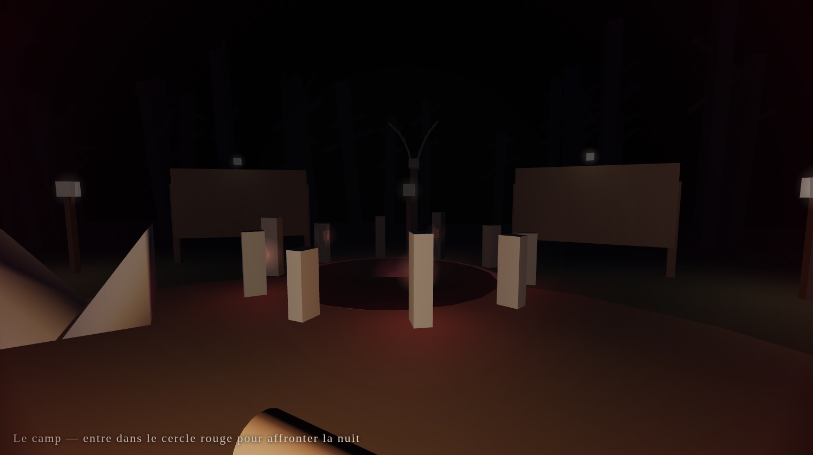
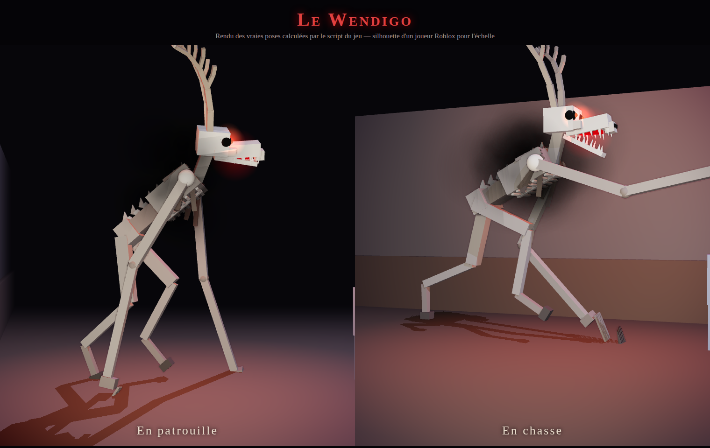

# 🕯️ Le Manoir des Ombres — escape horreur pour Roblox

Tu es enfermé, la nuit, dans un manoir plongé dans le noir. Quelque chose y rôde : **le Wendigo**.
Résous les énigmes et fuis avant l'aube… sans te faire attraper.

**Tout le jeu est généré par le code** (le camp, le manoir, le monstre) : il suffit de coller deux scripts
dans Roblox Studio. Les **sons** sont fournis dans le dossier [`sons/`](sons) et s'importent en quelques minutes.

*Aperçus calculés hors de Roblox à partir des scripts (rendu 3D approché) : le jeu réel utilise l'éclairage de Roblox.*

## Le camp (lobby)

Tout le monde apparaît au **camp**, une clairière en pleine forêt : feu de camp, tentes, lanternes, tombes,
un **totem au crâne de cerf**, un panneau qui affiche l'état de la partie et un tableau des **survivants**.

- **Entre dans le cercle de menhirs rouge** pour participer à la prochaine nuit.
- Dès qu'un joueur est dans le cercle, un compte à rebours de 20 s démarre (5 s si tout le monde est prêt).
- Les joueurs **dévorés** reviennent au camp et attendent la nuit suivante ; les survivants y reviennent à l'aube.
- Le classement (touche Tab) compte les **Évasions** et les **Captures** de chacun.

## Comment s'échapper

1. **Trouver les 3 fusibles** cachés dans le manoir.
2. **Rétablir le courant** au boîtier électrique de la **cave** (derrière la cuisine).
   Les lumières se rallument… et la porte du **bureau** se déverrouille. Mais le Wendigo devient plus rapide.
3. **Trouver le code du coffre-fort** : un carnet dans la bibliothèque explique que le code est l'heure à laquelle
   **l'horloge de la salle à manger** s'est arrêtée (le code change à chaque partie !).
4. **Prendre la clé maîtresse** dans le coffre, **ouvrir la porte d'entrée** et courir jusqu'au portail.

## Survivre au Wendigo

- **La lampe torche (F)** éclaire, mais le Wendigo **voit la lumière de très loin**. La batterie s'use : ramasse des piles.
- **Courir (Maj)** est plus rapide mais **fait du bruit** : il t'entend. Ton souffle est limité.
- **Les armoires (E)** te cachent… sauf si le Wendigo t'a **vu y entrer**.
- Un **code faux** au coffre fait du bruit et l'attire.
- Quand il approche, ton cœur bat et l'écran rougit. S'il t'attrape : jumpscare, et retour au camp.
- La manche dure **8 minutes**. Le jeu se joue seul ou **à plusieurs, en coopération** : les fusibles et la clé
  sont partagés par toute l'équipe.

## Le Wendigo

Une créature articulée de près de 140 pièces, animée en continu par le script :
- **immense et squelettique**, peau grise de cadavre, **côtes saillantes**, vertèbres et omoplates apparentes,
  **crinière de poils noirs** sur les épaules ;
- **crâne de cerf** au long museau, **grands bois ramifiés**, orbites noires où brillent **deux yeux rouges**,
  **mâchoire qui s'ouvre** sur des crocs, bave rougeoyante ;
- **bras interminables** aux doigts griffus, **pattes de cerf** terminées par des **sabots**, fumée noire ;
- **en patrouille** : il marche courbé, la tête se tord par à-coups, et **se baisse pour passer sous les portes** ;
  **en chasse** : il charge à quatre pattes, gueule ouverte, en poussant un **hurlement** ;
- on entend son **souffle rauque** et ses **sabots** de plus en plus fort quand il s'approche.

## Sons

Le dossier [`sons/`](sons) contient **18 sons créés pour le jeu** (fichiers MP3, libres d'utilisation) :

| Fichier | Rôle |
| --- | --- |
| `hurlement` | cri du Wendigo quand il te repère |
| `rale` | son souffle rauque (en boucle, en 3D sur lui) |
| `pas_monstre` | ses sabots |
| `coeur` | ton cœur qui s'accélère quand il approche |
| `jumpscare` | quand il t'attrape |
| `ambiance` | bourdon et vent dans le manoir (boucle) |
| `pluie`, `tonnerre` | l'orage |
| `lobby` | boîte à musique du camp (boucle) |
| `porte`, `armoire`, `ramasser`, `courant`, `deverrouillage` | portes, cachettes, objets, électricité, coffre |
| `bip`, `erreur` | clavier du coffre-fort |
| `respiration` | ton souffle quand tu es essoufflé ou caché (boucle) |
| `victoire` | quand tu t'échappes |

La réverbération change aussi selon l'endroit : **forêt** au camp, **couloirs de pierre** dans le manoir, son
**étouffé** quand tu es caché dans une armoire.

### Ajouter les sons dans Roblox Studio

1. Télécharge le dossier `sons` (ou tout le dépôt) sur ton ordinateur.
2. Dans Studio : **Affichage → Gestionnaire de ressources** (*Asset Manager*), puis le bouton
   **Importer en masse** (*Bulk Import*) et sélectionne les fichiers MP3.
3. Une fois importé, fais un clic droit sur chaque son → **Copier l'ID dans le presse-papiers**.
4. Colle chaque identifiant dans le tableau `SOUNDS` en haut du script `ManoirServeur`, par exemple :
   `hurlement = "1234567890",`
5. Relance le jeu. Un son laissé vide est simplement ignoré.

> Roblox limite le nombre d'imports audio gratuits par mois selon le compte. Si tu ne peux pas tout importer,
> commence par les plus importants : `hurlement`, `rale`, `pas_monstre`, `coeur`, `jumpscare`, `ambiance`,
> `tonnerre`, `pluie`, `lobby`, `porte`.

## Effets visuels

- **Orage** : pluie autour du manoir, **éclairs** qui illuminent tout, tonnerre qui fait trembler l'écran.
- **Fenêtres au clair de lune** avec rideaux et **rayons de lumière** visibles ; **poussière** qui flotte dans chaque pièce.
- **Lampe torche** avec **cône de lumière** visible et ombres ; elle **vacille** quand la batterie est faible.
- Bougies qui **vacillent**, **lustres** qui se rallument avec le courant, **toiles d'araignée**, **griffures** et
  **inscriptions sanglantes** sur les murs, **portraits dont les yeux s'allument** quand le Wendigo approche.
- **Peur** : quand il s'approche, l'image se **désature**, se **trouble** et rougit au rythme des **battements de cœur** ;
  le champ de vision se resserre et la caméra tremble. Balancement de la caméra en marchant, rayures de vieux film.
- **Jumpscare** : crâne de cerf aux yeux rouges et aux crocs qui fonce sur l'écran, flou et flash rouge.
- Post-traitement : halo lumineux (bloom), profondeur de champ, étalonnage froid, nuages d'orage.

## Installation dans Roblox Studio (5 minutes)

1. Ouvre **Roblox Studio** et crée un jeu avec le modèle **Baseplate**
   (la plaque grise est retirée automatiquement).
2. Dans l'**Explorer** :
   - clic droit sur **ServerScriptService** → *Insérer un objet* → **Script**, renomme-le `ManoirServeur`,
     efface tout et colle le contenu de [`src/server/ManoirServeur.server.luau`](src/server/ManoirServeur.server.luau) ;
   - ouvre **StarterPlayer**, clic droit sur **StarterPlayerScripts** → *Insérer un objet* → **LocalScript**,
     renomme-le `ManoirClient` et colle le contenu de [`src/client/ManoirClient.client.luau`](src/client/ManoirClient.client.luau).
3. Appuie sur **Jouer** (F5). Tu apparais au camp : entre dans le cercle rouge. Le Wendigo se réveille
   25 secondes après le début de la nuit…
4. (Recommandé) Ajoute les sons : voir la section **Sons** ci-dessus.

> 💡 **Important pour les graphismes** : dans l'Explorer, sélectionne **Lighting** et mets la propriété
> **Technology** sur **Future** (Roblox ne permet pas de la changer par script). Les ombres de la lampe,
> des fenêtres et des bougies seront bien plus belles. Dans les paramètres de Roblox, monte aussi
> la **qualité graphique** au maximum pour voir la pluie, la poussière et les rayons de lune.

Avec [Rojo](https://rojo.space) : `rojo serve` (le fichier `default.project.json` place les scripts).

## Commandes

| Action | PC | Mobile / manette |
| --- | --- | --- |
| Se déplacer | `Z Q S D` / `W A S D` | Joystick |
| Courir | `Maj gauche` (maintenir) | Bouton « Courir » |
| Lampe torche | `F` | Bouton « Lampe » / `Y` |
| Ramasser, lire, se cacher, ouvrir | `E` | Bouton d'action |

## Personnaliser

En haut du script serveur, la section **RÉGLAGES** permet de changer : la durée d'une manche, le délai avant le
réveil du monstre, le compte à rebours du camp, la vitesse du Wendigo, ses distances de vue et d'ouïe, la vitesse
des joueurs, l'usure de la batterie et les identifiants des sons.
