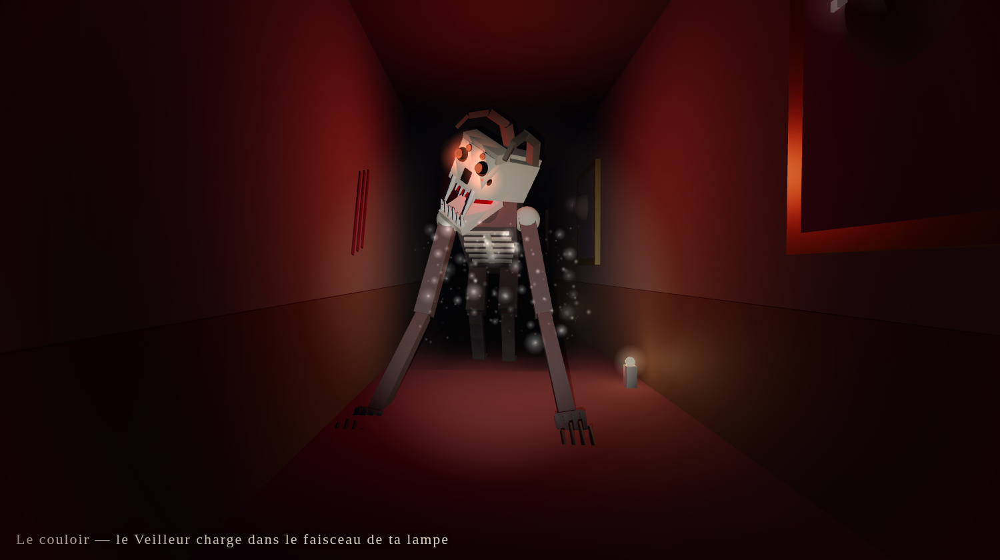
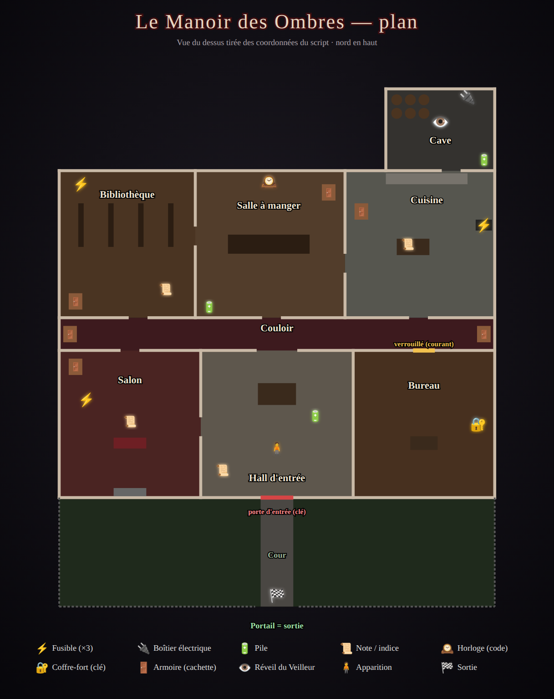
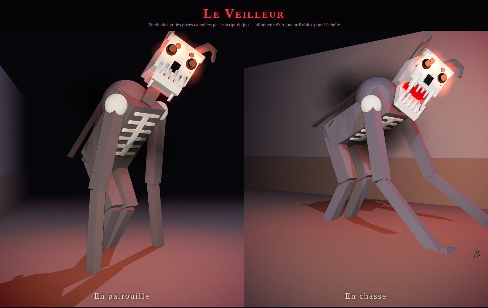

# 🕯️ Le Manoir des Ombres — escape horreur pour Roblox

Tu es enfermé, la nuit, dans un manoir plongé dans le noir. Quelque chose y rôde : **le Veilleur**.
Résous les énigmes et fuis avant l'aube… sans te faire attraper.

**Tout le manoir est généré par le code** : il suffit de coller deux scripts dans Roblox Studio.

*Aperçus calculés hors de Roblox à partir des scripts (rendu 3D approché) : le jeu réel utilise l'éclairage de Roblox.*

## Comment s'échapper

1. **Trouver les 3 fusibles** cachés dans le manoir.
2. **Rétablir le courant** au boîtier électrique de la **cave** (derrière la cuisine).
   Les lumières se rallument… et la porte du **bureau** se déverrouille. Mais le Veilleur devient plus rapide.
3. **Trouver le code du coffre-fort** : un carnet dans la bibliothèque explique que le code est l'heure à laquelle
   **l'horloge de la salle à manger** s'est arrêtée (le code change à chaque partie !).
4. **Prendre la clé maîtresse** dans le coffre, **ouvrir la porte d'entrée** et courir jusqu'au portail.

## Survivre au Veilleur

- **La lampe torche (F)** éclaire, mais le Veilleur **voit la lumière de très loin**. La batterie s'use : ramasse des piles.
- **Courir (Maj)** est plus rapide mais **fait du bruit** : il t'entend. Ton souffle est limité.
- **Les armoires (E)** te cachent… sauf si le Veilleur t'a **vu y entrer**.
- Un **code faux** au coffre fait du bruit et l'attire.
- Quand il approche, ton cœur bat et l'écran rougit. S'il t'attrape : jumpscare, et tu réapparais dans le hall.
- La manche dure **8 minutes**. Le jeu se joue seul ou **à plusieurs, en coopération** : les fusibles et la clé
  sont partagés par toute l'équipe.

## Le Veilleur

Une créature articulée d'une centaine de pièces, animée en continu par le script :
- corps décharné et voûté, **côtes apparentes**, colonne hérissée de pics, **bosse** et **lambeaux** qui pendent ;
- **crâne cornu** aux **six yeux rouges** lumineux, **mâchoire qui s'ouvre** sur deux rangées de crocs, bave rougeoyante ;
- **bras démesurés** à quatre griffes, **jambes aux genoux inversés**, fumée noire autour du corps ;
- **en patrouille** : il marche courbé, la tête se tord par à-coups ; **en chasse** : il charge **à quatre pattes**,
  gueule grande ouverte, et pousse un **hurlement** (« IL T'A VU », écran qui tremble).

## Effets visuels

- **Orage** : pluie autour du manoir, **éclairs** qui illuminent tout, tonnerre qui fait trembler l'écran.
- **Fenêtres au clair de lune** avec rideaux et **rayons de lumière** visibles ; **poussière** qui flotte dans chaque pièce.
- **Lampe torche** avec **cône de lumière** visible et ombres ; elle **vacille** quand la batterie est faible.
- Bougies qui **vacillent**, **lustres** qui se rallument avec le courant, **toiles d'araignée**, **griffures** et
  **inscriptions sanglantes** sur les murs, **portraits dont les yeux s'allument** quand le Veilleur approche.
- **Peur** : quand il s'approche, l'image se **désature**, se **trouble** et rougit au rythme des **battements de cœur** ;
  le champ de vision se resserre et la caméra tremble. Balancement de la caméra en marchant, rayures de vieux film.
- **Jumpscare** : crâne à six yeux et crocs qui fonce sur l'écran, flou et flash rouge.
- Post-traitement : halo lumineux (bloom), profondeur de champ, étalonnage froid, nuages d'orage.

## Installation dans Roblox Studio (5 minutes)

1. Ouvre **Roblox Studio** et crée un jeu avec le modèle **Baseplate**
   (la plaque grise est retirée automatiquement).
2. Dans l'**Explorer** :
   - clic droit sur **ServerScriptService** → *Insérer un objet* → **Script**, renomme-le `ManoirServeur`,
     efface tout et colle le contenu de [`src/server/ManoirServeur.server.luau`](src/server/ManoirServeur.server.luau) ;
   - ouvre **StarterPlayer**, clic droit sur **StarterPlayerScripts** → *Insérer un objet* → **LocalScript**,
     renomme-le `ManoirClient` et colle le contenu de [`src/client/ManoirClient.client.luau`](src/client/ManoirClient.client.luau).
3. Appuie sur **Jouer** (F5). Le Veilleur se réveille 25 secondes après le début…

> 💡 **Important pour les graphismes** : dans l'Explorer, sélectionne **Lighting** et mets la propriété
> **Technology** sur **Future** (Roblox ne permet pas de la changer par script). Les ombres de la lampe,
> des fenêtres et des bougies seront bien plus belles. Dans les paramètres de Roblox, monte aussi
> la **qualité graphique** au maximum pour voir la pluie, la poussière et les rayons de lune.

Avec [Rojo](https://rojo.space) : `rojo serve` (le fichier `default.project.json` place les scripts).

## Commandes

| Action | PC | Mobile / manette |
| --- | --- | --- |
| Se déplacer | `Z Q S D` / `W A S D` | Joystick |
| Courir | `Maj gauche` (maintenir) | Bouton « Courir » |
| Lampe torche | `F` | Bouton « Lampe » / `Y` |
| Ramasser, lire, se cacher, ouvrir | `E` | Bouton d'action |

## Personnaliser

En haut du script serveur, la section **RÉGLAGES** permet de changer : la durée d'une manche, le délai avant le
réveil du monstre, sa vitesse, ses distances de vue et d'ouïe, la vitesse des joueurs et l'usure de la batterie.
